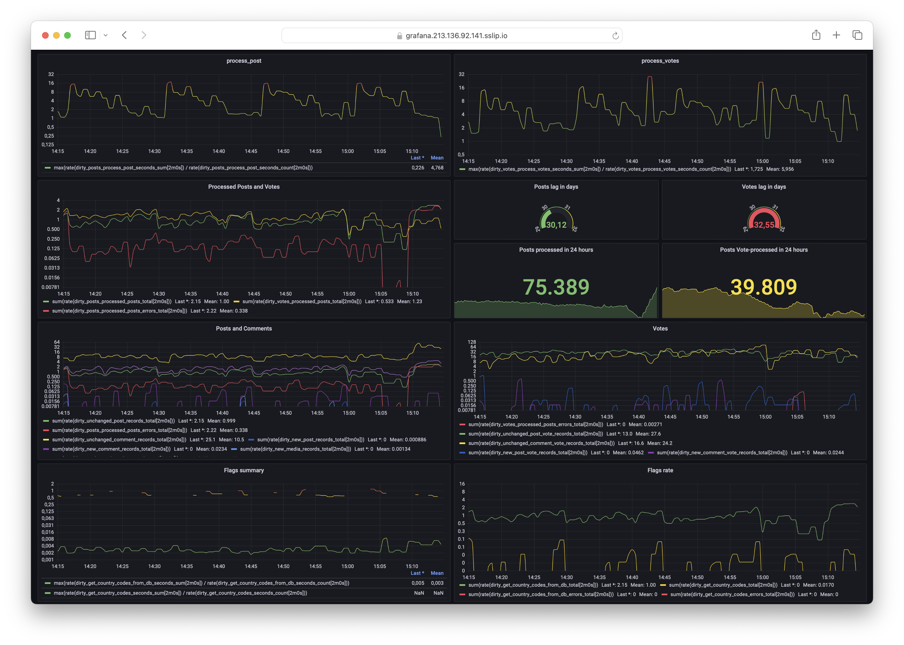

# dirty backup


Некогда живое и интересное сообщество d3.ru в последние годы заметно деградировало. А после нападения России на Украину сайт все больше напоминает живой труп.

С помощью этих простых скриптов можно хоть как-то сохранить то, что может быть удалено в любой момент.

Со временем это выродилось в Kubernetes кластер с Grafana и MongoDB. Регулярно собирались данные обо всех постах, комментариях, голосах, голосах в карму, подписчиках сообществ, постов на главной, картинках с их EXIF-тегами и т.д.



Проект закрыт в связи с потерей моего интереса к нему.

---

Количество данных на момент закрытия проекта (19 декабря 2023):

```js
db.posts.countDocuments({})
1_411_385
```

```js
db.comments.countDocuments({})
19_233_667
```

```js
db.karma.countDocuments({})
3_713_937
```

```js
db.votes.countDocuments({})
63_289_098
```

```js
db.media.countDocuments({})
2_246_832
```

```js
db.users.countDocuments({})
157_124
```

```js
db.stats()
{
    "db" : "dirty",
    "collections" : 14,
    "views" : 0,
    "objects" : 92902833,
    "avgObjSize" : 510.181559242655,
    "dataSize" : 47397312198.0,
    "storageSize" : 20712538112.0,
    "indexes" : 82,
    "indexSize" : 16050503680.0,
    "totalSize" : 36763041792.0, // 34.2382507 GiB
    "scaleFactor" : 1.0,
    "fsUsedSize" : 136483467264.0,
    "fsTotalSize" : 419491782656.0,
    "ok" : 1.0
}
```

```
mongodump-2023-12-19T15.43.16+0100.zip - 7.56 GiB
```
